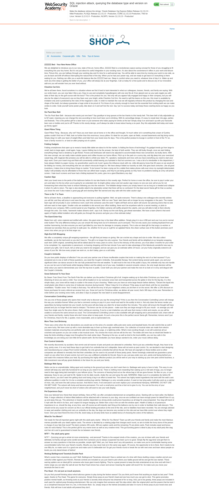
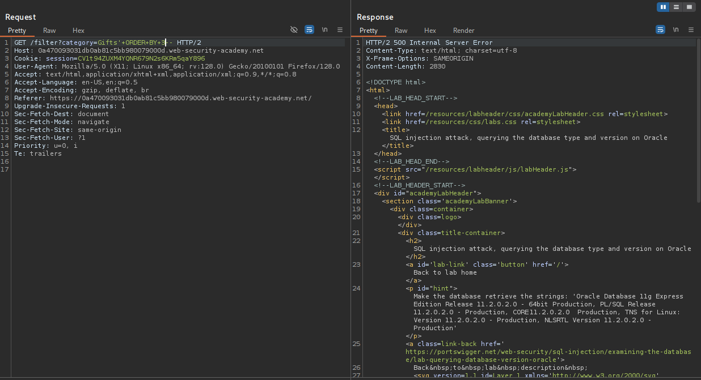
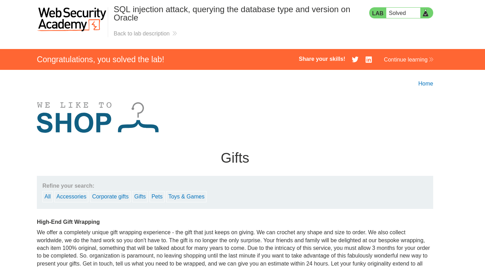

# Lab: SQL injection attack, querying the database type and version on Oracle


## Lab Information

 This lab contains a SQL injection vulnerability in the product category filter. You can use a UNION attack to retrieve the results from an injected query.

To solve the lab, display the database version string. 


## Frontend of the Application




## Steps to Reproduce

### Intercepting HTTP Requests

- Using BurpSuite we will intercept the HTTP request made in the `Gifts` section.

### Finding number of Columns

- After intercepting the request, I needed to find out number of columns returned by the original query so I started adding `ORDER BY` payloads until I hit an error.



- So the total number of columns returned are **2**.

### Finding String Compatible Datatype

- Now we need to find which column contains string datatype so that we can insert our query to find database version.

```sql
'+UNION+SELECT+'a',+NULL+FROM+DUAL--
```

- The above payload returned `200` HTTP status code so we need to insert our database version query here.


### Finding Database Version

- Below is the payload to find database version.

```sql
'+UNION+SELECT+banner,+NULL+FROM+v$version--
```





