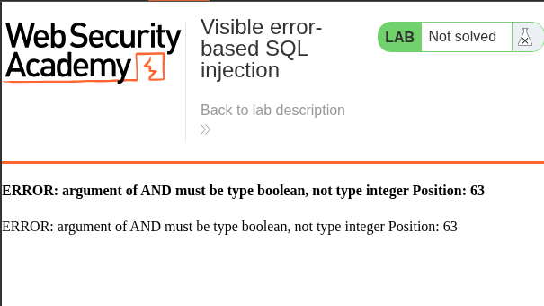

# Lab: Visible error-based SQL injection


## Lab Information

 This lab contains a SQL injection vulnerability. The application uses a tracking cookie for analytics, and performs a SQL query containing the value of the submitted cookie. The results of the SQL query are not returned.

The database contains a different table called users, with columns called username and password. To solve the lab, find a way to leak the password for the administrator user, then log in to their account. 

## Steps to Reproduce


### Checking Parameter Vulnerability

- Inserting the `'` quote beside the `TrackingID` gives us the below response, indicating the `TrackingID` is vulnerable to SQLi.


- Now injecting with the `'--` payload removes the error.


### Testing Error Entries

- Inserting the below payload produces the error as mentioned in the image.

```sql
' AND CAST((SELECT 1) AS int)--
```



- Now after fixing the Boolean expression using the below payload, the application produces no errors.

```sql
' AND 1=CAST((SELECT 1)AS int)--
```

