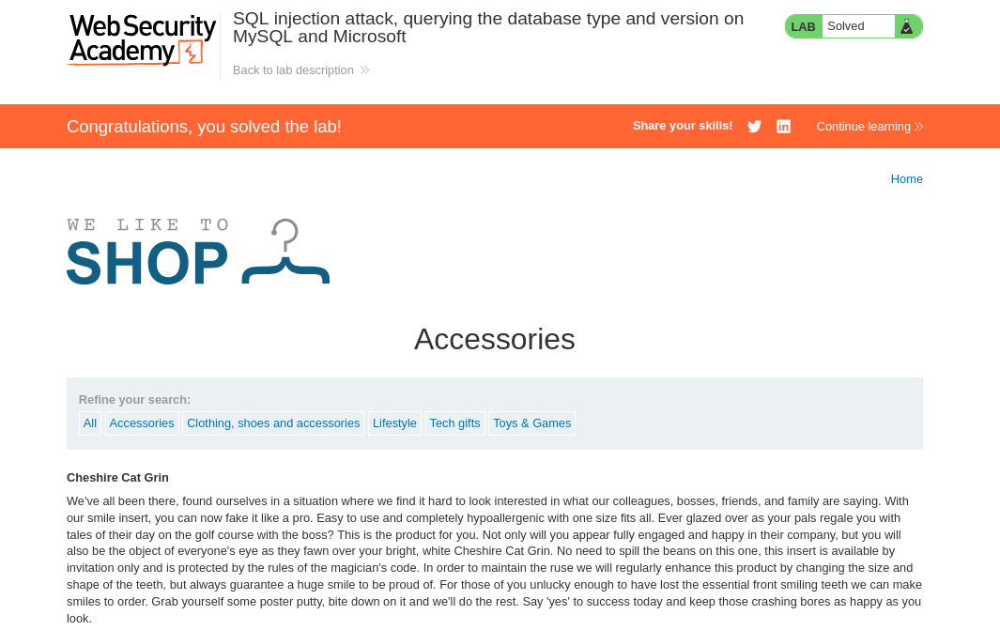

# Lab: SQL injection attack, querying the database type and version on MySQL and Microsoft


## Lab Information

 This lab contains a SQL injection vulnerability in the product category filter. You can use a UNION attack to retrieve the results from an injected query.

To solve the lab, display the database version string. 


## Steps to Reproduce

## Intercepting HTTP Request

- Intercept the HTTP request made when we click the `product` category.
- Forward the request to Repeater.

### Finding number of Columns

- Sending the below payload gave us an **Internal Server Error** so total columns are **2**.

```sql
'+ORDER+BY+3#
```

### Finding String type

- The below payload helps us understand which column is string type compatible.

```sql
'+UNION+SELECT+'a',+NULL#
```

### Finding Database Version

- The below payload gives us our database version.

```sql
'+UNION+SELECT+@@version,+NULL#
```





