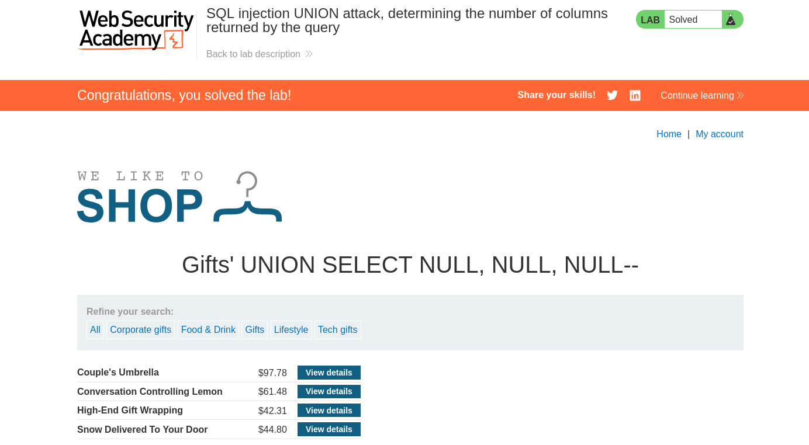

# Lab: SQL injection UNION attack, determining the number of columns returned by the query


## Lab Information

This lab contains a SQL injection vulnerability in the product category filter. The results from the query are returned in the application's response, so you can use a UNION attack to retrieve data from other tables. The first step of such an attack is to determine the number of columns that are being returned by the query. You will then use this technique in subsequent labs to construct the full attack.

To solve the lab, determine the number of columns returned by the query by performing a SQL injection UNION attack that returns an additional row containing null values.


## Steps to Reproduce

### Finding number of Columns

- Intercept the request made in the `Gifts` category using BurpSuite.
- After intercepting the request send it to the repeater. You can manually check using `ORDER BY` how many columns required.
- Use the below payload and append it to the HTTP request to get the number of columns returned by the original query.

```sql
'+UNION+SELECT+NULL,+NULL,+NULL--
```

- The above payload returns no error so total columns are **3**.




