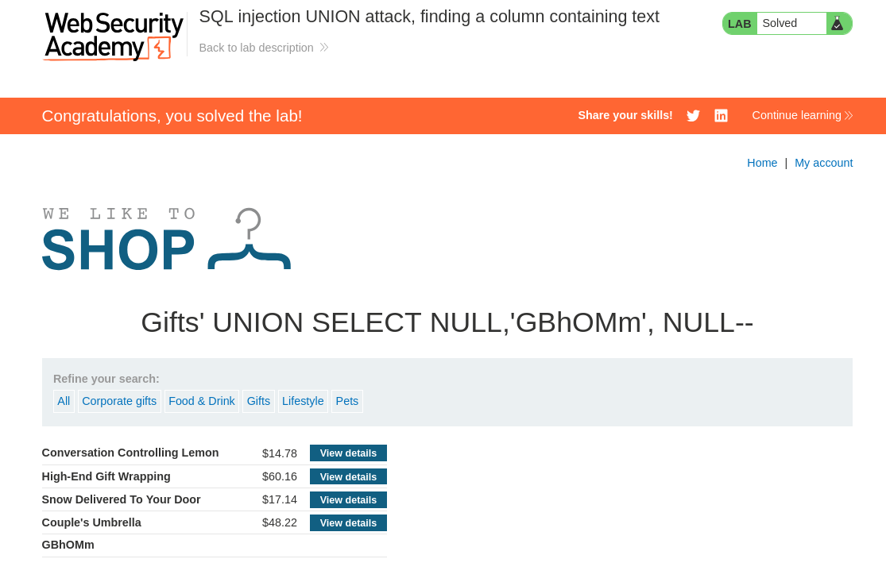

# Lab: SQL injection UNION attack, finding a column containing text

## Lab Information

 This lab contains a SQL injection vulnerability in the product category filter. The results from the query are returned in the application's response, so you can use a UNION attack to retrieve data from other tables. To construct such an attack, you first need to determine the number of columns returned by the query. You can do this using a technique you learned in a previous lab. The next step is to identify a column that is compatible with string data.

The lab will provide a random value that you need to make appear within the query results. To solve the lab, perform a SQL injection UNION attack that returns an additional row containing the value provided. This technique helps you determine which columns are compatible with string data.  


## Steps to Reproduce
### Finding String Compatible Column

- Intercept the request made in `Gifts` category using BurpSuite. From the previous examples you should already know how many columns required.
- Now we need to find which column is string type compatible.
- We need to make the database retrieve **GBhOMm** text. To do this we can use the below payload.

```sql
'+UNION+SELECT+NULL,'GBhOMm',+NULL--
```

- The above payload works and we understand that column 2 is string type compatible.




